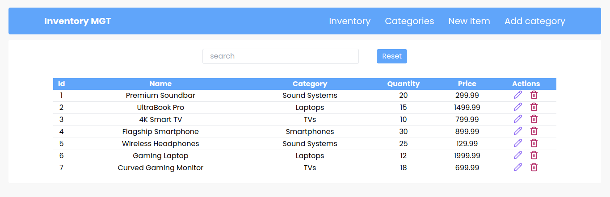

## Inventory CRUD App

## Description
This is a CRUD app that allows the user to create, read, update, and delete items from an inventory. The user can also search for items by name or category.

Data is not saved to database, only state gets updated.

